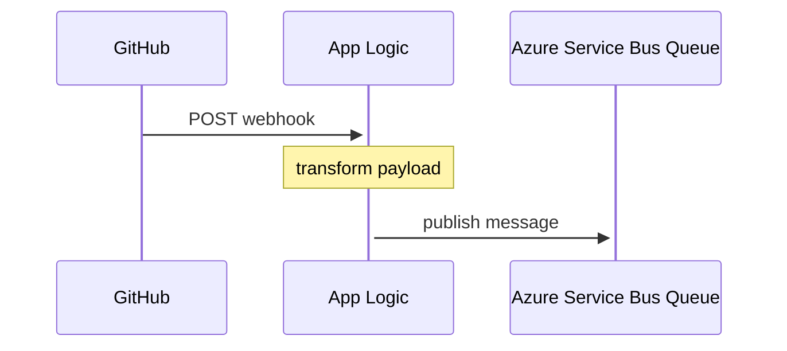

# Publishing Webhooks

This codebase contains logic to consume webhook payloads from various queues, however it does not contain the logic required to publish webhooks to a queue. These instructions document a cloud-native option for achieving this. These instructions were created from information found in [this issue](https://github.com/microsoft/opensource-management-portal/issues/454).

## Leverage App Logic to process webhooks

Azure Logic Apps is a cloud platform where you can create and run automated workflows with little to no code. This service allows us to quickly build scalable and performant services without having to maintain additional code. The following steps will walk you through how to create a Logic App that will process webhooks from GitHub.

### Sequence Diagram

### Configuration steps

1. `export RESOURCEGROUP=[name of your resource group]`
2. Create a service bus in Azure.

   `az servicebus namespace create --resource-group $RESOURCEGROUP --name portal-events --location eastus`

3. Create the `events` queue in the service bus.

   `az servicebus queue create --resource-group $RESOURCEGROUP --namespace-name portal-events --name events`

4. Create a shared access policies from the Azure Portal.

   1. Navigate to the service bus namespace.
   2. Click `Shared access policies` on the sidebar.
   3. Click "Add"
   4. Policy name: `send-events`
   5. Permission `Send`
   6. Copy down the primary connection string to be set in Logic App.
   7. Navigate to the service bus namespace.
   8. Click `Shared access policies` on the sidebar.
   9. Click "Add"
   10. Policy name: `read-events`
   11. Permission `Listen`
   12. Copy down the primary connection string to be set in Logic App.

5. Update parameters in [workflow.json](workflow.json).

   1. Replace `00000000-0000-0000-0000-000000000000` with your subscription id.
   2. In the servicebus connectionId property also update the resource group.

6. Create the workflow.

   `az logic workflow create --resource-group $RESOURCEGROUP --location eastus --name process_webhooks --definition "workflow.json"`

### Environment variables

Set the following environment variables for the firehose service.

- Ensure `GITHUB_WEBHOOKS_PROVIDER` environment variable is set to `servicebus`
- Ensure `GITHUB_WEBHOOKS_SERVICEBUS_QUEUE` is set to `events`
- `GITHUB_WEBHOOKS_SERVICEBUS_CONNECTIONSTRING`= [connection string from step 5]
